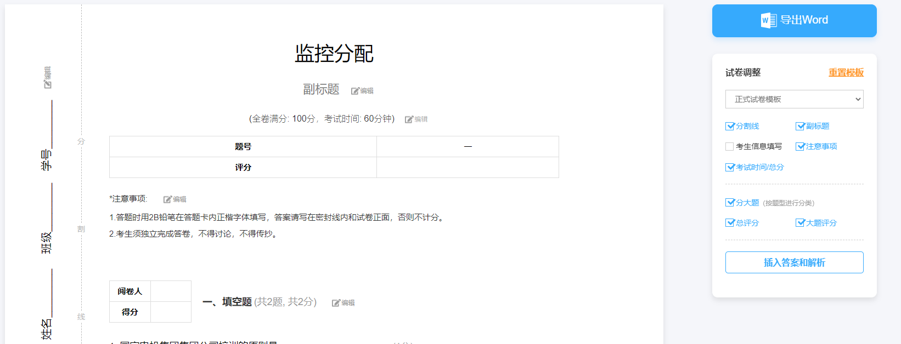
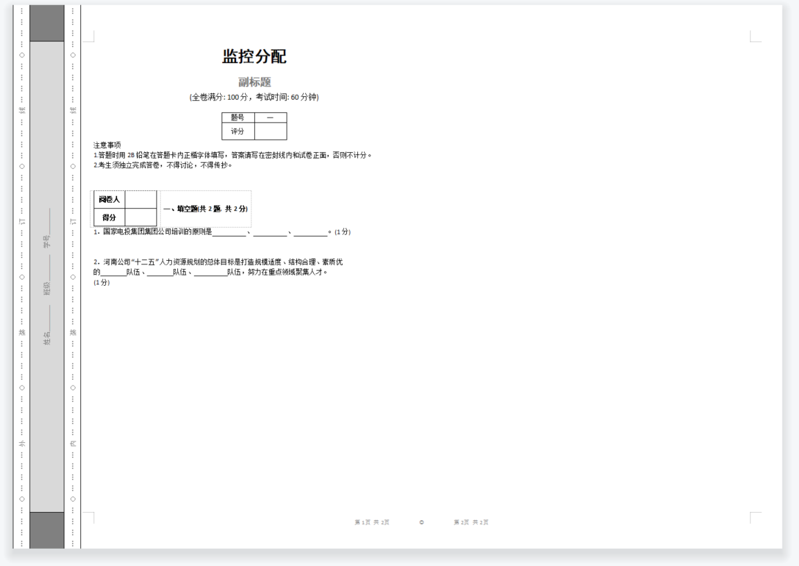

# 1、为什么word的软回车不能识别为回车？
## 需求来源
    在将word作为数据模板来编写数据导入系统时, 
    总有客户去复制粘贴、或者使用shift+回车的方式来输入空格
## 解决
    好吧, 问题出现了就要解决吧
    第一步: 我们要搞清楚软回车跟回车有什么区别?
        创建一个word文档, 注意使用office, 不要用wps, 往里面分别输入回车跟软回车
    第二步: 将后缀名修改为zip, 因为docx本身就是一个压缩文件, 然后解压并打开word/document.xml
        可以看到回车为段落符号<w:p/>而软回车为段落符里面有<w:br>
    第三步: 改phpword的源码吧, 打开phpword\src\PhpWord\Reader\Word2007\AbstractPart.php的TextRun的判断中增加软回车的判断

# 2、我们考试系统的试卷能不能直接导出来让老师们打印完就能考试呢?
## 需求来源
    考试系统的客户很多来自于学校, 但是一些学校的计算机可能会很缺, 这时候这个需求就来了。程序员没资格说不会……开干吧
## 解决
    具体就不展开了, 直接说难点吧, 如图所示, 就是要有这些功能

    稍微想了一想, 导出文档的话, 格式处理挺复杂的, 那就换方法吧, 从上面已知word属于压缩文件, 所以把内容替换了就行, 制作一个word模板方便很多, 制作完后再替换处理后的文本进去就行了
