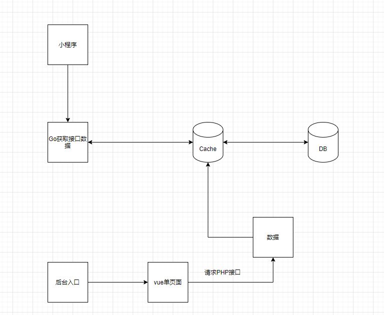

# 记一次项目负责人的经历
## 负责项目 `艾刷`
    接到项目的第一件事, 在我看来无非是搞清楚目标对象(群体)
    处理好项目需求, 确定需求可完成度等一系列事, 不展开描述了
接下来则到了项目开始时间, 在技术方面我觉得有一方面非常重要`架构`, 站在一个项目负责人的角度来看待架构的话, 我觉得能分3种
* 团队架构
* 项目架构
* 技术架构

    这里插播介绍一下公司原后台项目情况, 方便后面对比, 使用Joomla, PHP前端混合写法(前后不分离)

### 团队架构
在一家创业公司里, 虽然是一个新项目的搭建, 但我还是想让这个团队能够成长起来独当一面

    要什么? 一个能完成该项目的团队、公司强烈要求接口需要使用Go编写, 以及需要把后台项目搭建在原有的项目上(此处默默流泪……)
    有什么? 一个小组的配备, 包含2个前端、1个Go开发者、2个PHP开发, 以及其他可协调调度的人力资源。由于后台搭建在原有项目上, 所以后台的服务器不需要考虑, 客户端的搭建在小程序上, 这方面也不需要考虑, 一个API接口的调度服务器, 暂时可以搭建在原有服务器上, 其他方面暂时不考虑
    能做什么? 这个配备完成一个小项目没啥问题, 那接下来的话是考虑怎么能让大家开发得开心, 但我还有一个目标: 让公司的技术栈升级, 公司原有的项目是PHP前端混合写法(大家伙都想吐了), 有了以上两个要求, 就开始采用前后端半分离来写了(为什么不用前后端完全分离? 因为多了一个中间件这个价值在项目前期还没体现出来优势有多强)

### 项目架构
客户端正常使用前后端半分离没毛病, 但是正常的前后端半分离模式很难在原有公司项目上进行扩展, 于是在正常前后端分离的架构中又引入了入口文件, 于是架构就变成这个样子(其中vue单页面是新引入的入口文件)

### 技术架构
有了上述的信息之后, 就能确定下来需要的主要的技术了: Vue/Joomla/Go/小程序/MySQL/Redis
但站在一个刚接触这些的团队上, 更重要的是定下开发规范:
RESTFul API比较主流、成熟的一套API规范
前端组件文档规范, 问了一些朋友发现每个人都不一样, 就拿个人感觉比较好的方式算了--在设计稿规范上写上相应的组件及调用方式(此处感谢设计师的支持)